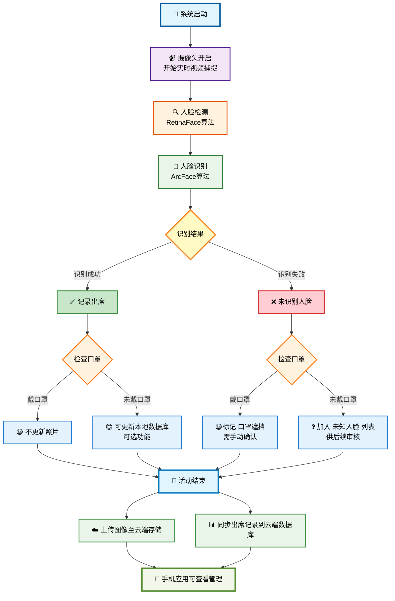

# 提案书：教会人脸识别出席系统

## 1. 📝 概述：

本提案介绍一个使用人脸识别技术的智能出席追踪系统，专为教会成员设计。系统通过摄像头进行实时人脸检测与识别，在如主日崇拜等活动期间自动记录出席情况，无需人工操作。它确保记录准确，减少人为错误，并允许通过连接云端的手机应用进行后续查看与管理。

## 2. 🎯 目标：

- 自动记录所有教会成员的出席情况。
- 通过人脸识别识别已注册成员。
- 识别并处理未注册或佩戴口罩的人员。
- 将出席数据与照片上传至云端以供查看。
- 允许管理员和牧师通过手机应用查看出席状态。

## 3. 🔧 系统流程：

1. **系统启动**
2. **摄像头开启，开始实时视频捕捉**
3. **人脸检测（RetinaFace）**
4. **人脸识别（ArcFace）**
5. **判断逻辑：**
   - 如果识别到人脸：
     - 记录出席
     - 检查是否戴口罩：
       - 是 → 不更新照片
       - 否 → 可自动更新本地图片数据库（可选）
   - 如果未识别：
     - 检查是否戴口罩：
       - 是 → 标记为“口罩遮挡”，需手动确认
       - 否 → 加入“未知人脸”列表，供后续审核
6. **活动结束后：**
   - 上传所有识别/未识别人脸图像至云端存储
   - 同步出席记录到云端数据库

## 4. 系统架构

- **本地系统（教会电脑）**：
  - 执行人脸检测与识别模块
  - 存储临时图像数据与日志
- **云端后端**：
  - Firestore 用于存储用户资料与出席记录
  - Firebase Storage 用于存储上传的人脸图像
- **手机应用（未来阶段）**：
  - 查看出席记录，确认未知人脸
  - 提供管理员功能

## 5. 技术栈：

- 编程语言：Python
- 人脸检测：RetinaFace（DeepFace）
- 人脸识别：ArcFace（DeepFace）
- 数据库：Firebase Firestore（NoSQL）
- 云端存储：Firebase Storage
- 前端（未来）：Flutter 手机应用

## 6. 数据存储策略

- **本地电脑：**
  - 活动期间处理的临时人脸图像
  - 离线识别数据库（按人名分类的图像文件夹）
- **Firebase Firestore：**
  - 成员资料（姓名、ID、图像链接）
  - 出席记录（含时间戳）
- **Firebase Storage：**
  - 活动结束后上传所有图像（已识别和未知）

> Firestore 与 Firebase Storage 提供免费额度（每日约 5 万次读取，1GB 存储空间，可后续升级）。

## 7. 硬件与部署建议

### 当前教会电脑配置：

- CPU：Intel i5-4460
- 内存：16GB
- GPU：Intel HD Graphics（无独显）
- 用途：同时运行 OBS 直播

### 建议升级：

- **GPU**：添加 NVIDIA RTX 3060（约 RM1200）
- **内存**：升级至 32GB（约 RM200）
- **CPU**：升级至 Intel Core i5-12400F（约 RM600）

### 推荐部署：

- 升级后的电脑用于 **离线本地人脸识别系统**
- 使用 Firebase 作为 **云端数据库与图像存储方案**，供手机端访问

## 8. 📆 时间与成本估算

| 阶段      | 工作内容                                 | 时间 | 预计成本（RM） |
| --------  | --------------------------------------- | ---- | ------------- |
| 阶段 1    | 本地人脸识别系统 + 出席记录功能            | 2 周 | 0             |
| 阶段 2    | Firebase 云端同步 + 管理界面              | 2 周 | 0             |
| 阶段 3    | 开发手机应用，用于查看与确认               | 2 周 | 0             |
| 测试阶段  | 测试所有功能                              | 2 周 | 0             |
| 电脑升级  | CPU + GPU + 内存升级                      |      | 2000          |
| 摄像机    | CCTV (TP-Link Tapo C230 5MP 3K Wireless) |      | 150           |

****数据存储超过免费额度，就会增加成本** \
**总开发时间**：约 8 周\
**总硬件预算成本**：约 RM2150\
**总预算津贴 (Allowance Budget)**：约 RM1000

## 9. 系统的好处

- 大幅降低出席记录的人力负担与错误率
- 实现每周出席的集中与自动追踪
- 管理员/牧师可通过手机轻松查看与管理出席
- 可拓展系统架构，支持将来人数增长与功能升级

