# Proposal: Face Recognition Attendance System for Church

## 1. 📝 Overview:

This proposal outlines a smart attendance tracking system using Face Recognition technology for church members. The system leverages live facial detection and recognition to automatically mark attendance during events such as Saturday services, without manual input. It ensures accurate records, reduces human error, and allows later review via a cloud-connected mobile app.

## 2. 🎯 Goals:

- Automate attendance taking for all church members.
- Use face recognition to identify known members.
- Detect and handle unknown or masked individuals.
- Upload attendance data and pictures to the cloud for review.
- Allow admin and pastors to check attendance status via mobile app.

## 3. 🔧 System Flow:

1. **System Startup**
2. **Live Video Feed Begins (Camera)**
3. **Face Detection (RetinaFace)**
4. **Face Recognition (ArcFace)**
5. **Decision Tree:**
   - If face is known:
     - Mark attendance
     - Check if mask:
       - If yes → Do NOT update photo
       - If no → Automatically update file-based database (optional)
   - If face is unknown:
     - Check if wearing mask:
       - If yes → Mark as "Mask Detected", require manual check
       - If no → Add to "Unknown Faces" list for review
6. **After Event**
   - Upload all recognized/unknown images to cloud storage
   - Sync attendance records with cloud database

```mermaid
flowchart TD
    A[🚀 System Startup] --> B[📹 Camera Activation<br/>Start Real-time Video Capture]
    B --> C[🔍 Face Detection<br/>RetinaFace Algorithm]
    C --> D[🧠 Face Recognition<br/>ArcFace Algorithm]
    
    D --> E{Recognition Result}
    
    E -->|Success| F[✅ Record Attendance]
    E -->|Failed| G[❌ Unrecognized Face]
    
    F --> H{Check Mask}
    H -->|Wearing Mask| I[😷 Do Not Update Photo]
    H -->|No Mask| J[😊 Update Local Database<br/>Optional Feature]
    
    G --> K{Check Mask}
    K -->|Wearing Mask| L[😷 Mark as Mask Blocked<br/>Requires Manual Confirmation]
    K -->|No Mask| M[❓ Add to Unknown Faces List<br/>For Later Review]
    
    I --> N[🏁 Activity End]
    J --> N
    L --> N
    M --> N
    
    N --> O[☁️ Upload Images to Cloud Storage]
    N --> P[📊 Sync Attendance Records to Cloud Database]
    
    O --> Q[📱 Mobile App Management Available]
    P --> Q
    
    style A fill:#e1f5fe,stroke:#01579b,stroke-width:3px,color:#000
    style B fill:#f3e5f5,stroke:#4a148c,stroke-width:2px,color:#000
    style C fill:#fff3e0,stroke:#e65100,stroke-width:2px,color:#000
    style D fill:#e8f5e8,stroke:#2e7d32,stroke-width:2px,color:#000
    style E fill:#fff9c4,stroke:#f57f17,stroke-width:3px,color:#000
    style F fill:#c8e6c9,stroke:#388e3c,stroke-width:2px,color:#000
    style G fill:#ffcdd2,stroke:#d32f2f,stroke-width:2px,color:#000
    style N fill:#e1f5fe,stroke:#0277bd,stroke-width:3px,color:#000
    style Q fill:#f1f8e9,stroke:#558b2f,stroke-width:3px,color:#000
    
    classDef decision fill:#fff3e0,stroke:#ff6f00,stroke-width:2px,color:#000
    classDef process fill:#e3f2fd,stroke:#1976d2,stroke-width:2px,color:#000
    classDef endpoint fill:#e8f5e8,stroke:#388e3c,stroke-width:2px,color:#000
    
    class H,K decision
    class I,J,L,M process
    class O,P endpoint
```

## 4. System Architecture

- **Local System (Church PC)**:
  - Runs face detection & recognition modules
  - Stores temporary image data & logs
- **Cloud Backend**:
  - Firestore for storing user records, attendance logs
  - Firebase Storage for storing uploaded face images
- **Mobile App (Future Phase)**:
  - Allows viewing records, confirming unknowns
  - Admin management features

## 5. Technical Stack:

- Programming Language: Python
- Face Detection: RetinaFace (via DeepFace)
- Face Recognition: ArcFace (via DeepFace)
- Database: Firebase Firestore (NoSQL)
- Storage: Firebase Storage
- Frontend (future): Flutter mobile app

## 6. Data Storage Strategy

- **Local PC**:
  - Temporary face images (processed during event)
  - Offline recognition DB (folder with labeled images)
- **Firebase Firestore**:
  - Member records (name, ID, image references)
  - Attendance logs with timestamps
- **Firebase Storage**:
  - Upload all images after event (both known/unknown)

> Firestore and Firebase Storage are free with usage limits (approx. 50K reads/day, 1GB storage free, can expand later if needed).

## 7. Hardware & Deployment Options

### Current Church PC:

- CPU: Intel i5-4460
- RAM: 16GB
- GPU: Intel HD Graphics (no dedicated GPU)
- Usage: Also used for OBS livestreaming

### Suggested Upgrade:

- **GPU**: Add NVIDIA RTX 3060 (\~RM1200)
- **RAM**: Upgrade to 32GB (additional \~RM200)
- **CPU**: Upgrade to modern CPU for smoother multitasking (INTEL CORE I5 12400F \~RM600)

### Recommendation:

- Use this upgraded PC for **offline processing only**
- Use Firebase as **cloud backend** for data storage and mobile app access

## 8. 📆 Time & Cost Estimation

| Phase          | Tasks                                              | Duration | Cost Estimate (RM)   |
|----------------|----------------------------------------------------| -------- |----------------------|
| Phase 1        | Basic Face Recognition (local), Attendance Logging | 2 weeks  | 0                    |
| Phase 2        | Add Cloud Sync (Firebase), Admin Panel             | 2 weeks  | 0                    |
| Phase 3        | Build Mobile App for Review                        | 2 weeks  | 0                    |
| Testing Phase  | Testing all function                               | 2 weeks  | 0                    |
| Computer       | CPU + GPU + RAM Upgrade + CCTV                     |          | 2000                 |
| Camera         | CCTV (TP-Link Tapo C230 5MP 3K Wireless)           |          | 150                  |

****Data storage exceeding the free quota will increase costs** \
**Total Time**: \~8 weeks\
**Total Hardware Cost**: \~RM2150\
**Allowance Budget**: \~RM1000

## 9. System Benefits

- Reduce manual effort and error in attendance taking
- Centralized and automatic tracking of weekly attendance
- Easy monitoring by church admin/pastors via mobile
- Future-proof system with expandable cloud backend

