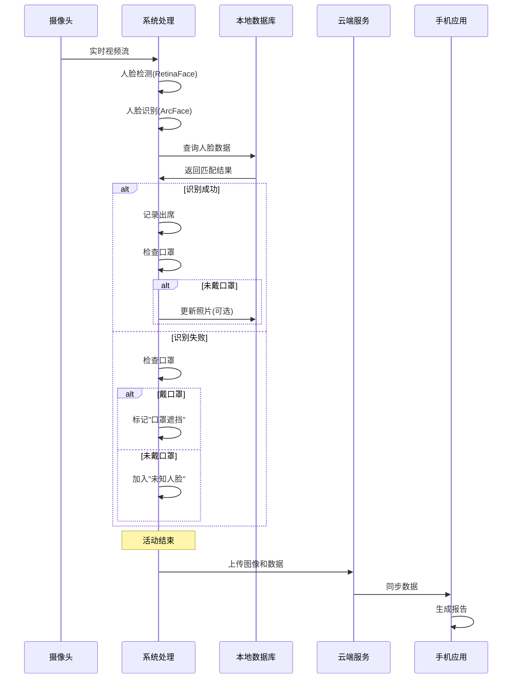

```mermaid
sequenceDiagram
    participant C as 摄像头
    participant S as 系统处理
    participant DB as 本地数据库
    participant Cloud as 云端服务
    participant App as 手机应用
    
    C->>S: 实时视频流
    S->>S: 人脸检测(RetinaFace)
    S->>S: 人脸识别(ArcFace)
    S->>DB: 查询人脸数据
    DB->>S: 返回匹配结果
    
    alt 识别成功
        S->>S: 记录出席
        S->>S: 检查口罩
        alt 未戴口罩
            S->>DB: 更新照片(可选)
        end
    else 识别失败
        S->>S: 检查口罩
        alt 戴口罩
            S->>S: 标记"口罩遮挡"
        else 未戴口罩
            S->>S: 加入"未知人脸"
        end
    end
    
    Note over S: 活动结束
    S->>Cloud: 上传图像和数据
    Cloud->>App: 同步数据
    App->>App: 生成报告
```
